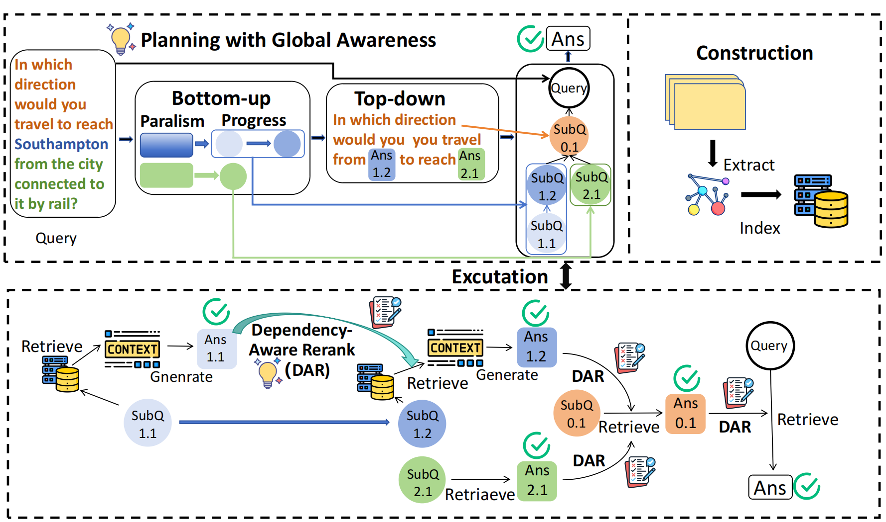

# PankRAG
Modified from nano-graphrag


# Contents

- Usage
  - Installation
  - Configuration
  - Running

## Usage

### Installation

```bash
conda create -n PankRAG python=3.10 -y  
conda activate PankRAG  
pip install -r requirements.txt
`````
### Configuration

Before running, please adjust or configure the corresponding settings in run.py and any other program files yourself—this includes the model name, api_key, etc.

### Running

```bash
python run.py
`````
